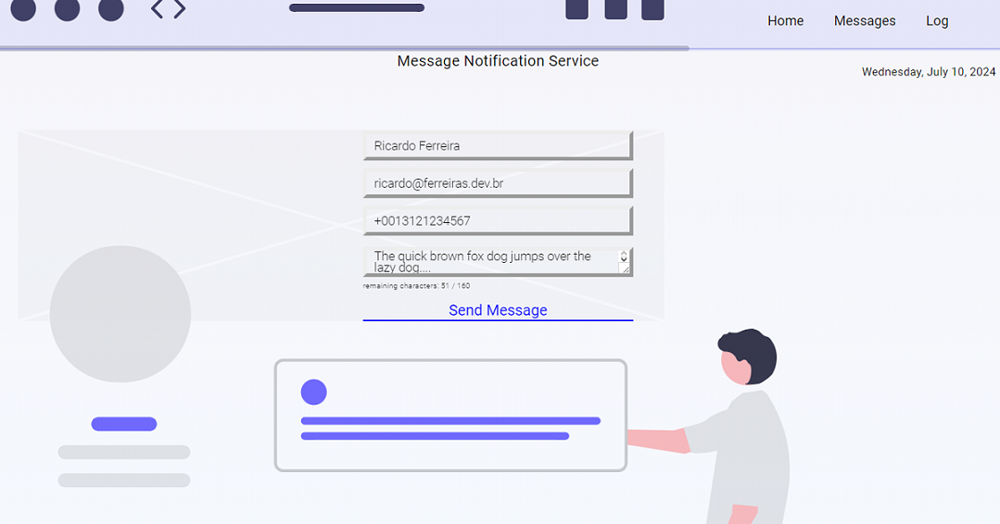

## Take-home Microservices Challenge
This is how we faced the challenge of creating a frontend UI  to explore
noitifications-api features

## _Table of contents_
- [Take-home Microservices Challenge](#take-home-microservices-challenge)
- [_Table of contents_](#table-of-contents)
- [_Overview_](#overview)
- [_Screenshot_](#screenshot)
- [_Links_](#links)
- [_Built with_](#built-with)
- [_How I did it_](#how-i-did-it)
- [_Continued development_](#continued-development)
  - [_Useful resources_](#useful-resources)
- [_Author_](#author)
- [Acknowledgments](#acknowledgments)
## _Overview_
These web pages were coded using Angular 18
The design is structured as shown:
- src|
  - app |
     - components |
          -  header
          -  footer
     -  pages
  - assets |
  - scss|
    - base
    -  components
       -  footer
       -  header
    -  layout
  - _index.scss
- index.html
- main.ts
- styles.css 
## _Screenshot_
[]()
## _Links_
- Live Site URL: [https://www.ferreiras.dev.br] 
## _Built with_

[](https://skillicons.dev)


 ## _How I did it_
```jsx
import { HttpClient, HttpErrorResponse } from '@angular/common/http';
import { EventEmitter, Injectable } from '@angular/core';
import { MessageData } from '../interface/imessage-data';
import { SubscriberData } from '../interface/isubscriber-data';
import { catchError, retry, tap, throwError } from 'rxjs';

@Injectable({
  providedIn: 'root'
})

export class MessageService {


  statusChange: EventEmitter<any> = new EventEmitter();

  constructor(
    private http: HttpClient,
  ) { }

  register(data: SubscriberData) {
    return this.http.post<MessageData>('http://127.0.0.1/:8095/messages', {
      username: data.username,
      email: data.email,
      phone: data.phone,
      message: data.message
    }
    ).pipe(
      catchError(this.handleErrors),
      tap((response: any) => {
        this.statusChange.emit(response);
        console.log(response);
      }),

    );

  }

  getMessages(data: MessageData) {
    return this.http.get<MessageData[]>('http://127.0.0.1/:8095/messages')
      .pipe(
        retry(2),
        catchError(this.handleErrors)
      )
  }

  handleErrors(errObject: HttpErrorResponse) {

    if (errObject.status === 0) {
      return throwError('Sorry! Message Services not Available! Try again later!!!')
    }

    return throwError(errObject.error);

  }


}

``` 

## _Continued development_
- maybe
### _Useful resources_
- [https://angular.io] Build user interfaces out of individual pieces called components!.

## _Author_
- Website - [https://ferreiras.dev.br] 
## Acknowledgments
- 
