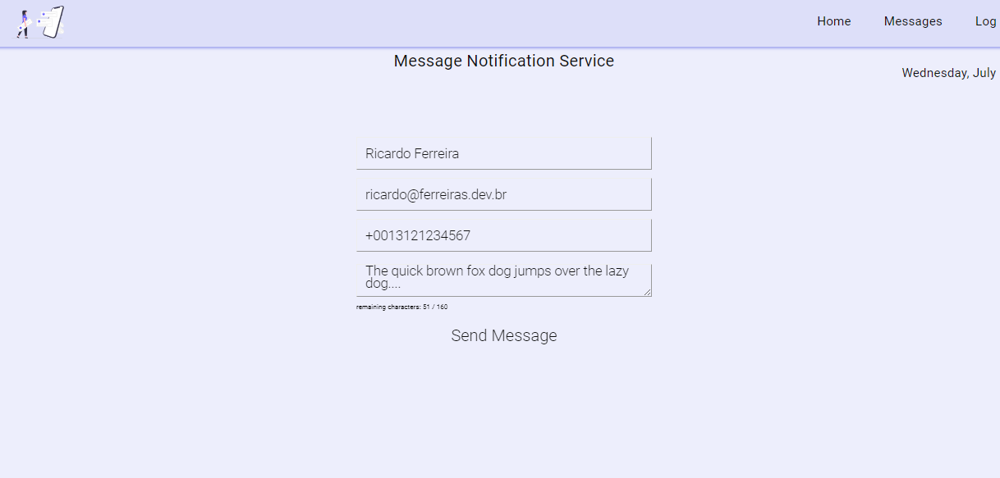

## Take-home Microservices Challenge
This is how we faced the challenge of creating a frontend UI  to explore
noitifications-api features

## _Table of contents_
- [Take-home Microservices Challenge](#take-home-microservices-challenge)
- [_Table of contents_](#table-of-contents)
- [_Overview_](#overview)
- [_Screenshot_](#screenshot)
- [_Links_](#links)
- [_Built with_](#built-with)
- [_How I did it_](#how-i-did-it)
- [_Continued development_](#continued-development)
  - [_Useful resources_](#useful-resources)
- [_Author_](#author)
- [Acknowledgments](#acknowledgments)
## _Overview_
These web pages were coded using Angular 18
- src|
    - App.tsx
    - assets|
    - components|
      - Contact
      - Footer
      - Header
      - Project
      - Skill
      - welcome
    - routes
      - Contacts
      - Feet
      - Home
      - Intro
      - Projects
      - Skills
    - utils
   - App.tsx
   - index.css
   - main.tsx
   - index.html
   - tsconfig.json
   - tsconfig.node.json
   - vite.config.js
   - yarn.lock
- public|

## _Screenshot_
[]()
## _Links_
- Live Site URL: [https://www.ferreiras.dev.br] 
## _Built with_

[](https://skillicons.dev)


 ## _How I did it_
```jsx
export class HomeComponent {

  @ViewChild('myForm', { static: true }) messageForm!: NgForm;
  email!: string;
  phoneNumber!: string;
  name!: string;
  message!: string;
  maxChars = 160;
  formMode = false; 
  hasError = null;
  submitted = false;

 
  
  constructor(
    private router: Router) {

  }

  toggleMode() {
    this.formMode = !this.formMode;
  }
  
  submitHandler() {

    this.submitted = true; 

  }

  
}

``` 

## _Continued development_
- maybe
### _Useful resources_
- [https://angular.io] Build user interfaces out of individual pieces called components!.

## _Author_
- Website - [https://ferreiras.dev.br] 
## Acknowledgments
- 
